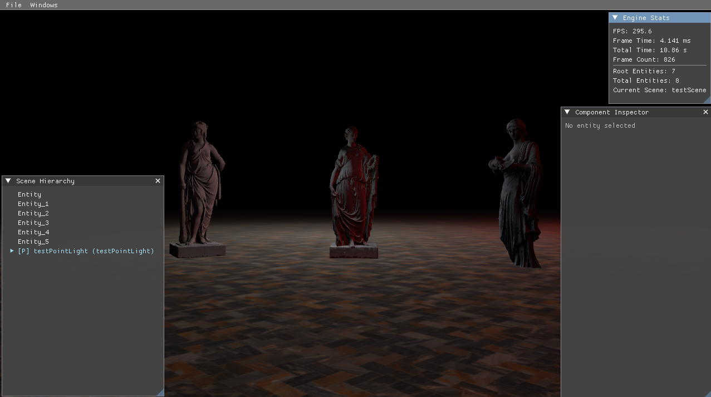
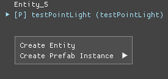
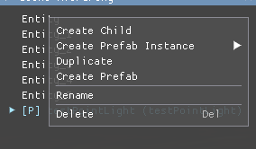
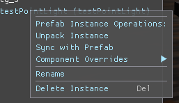
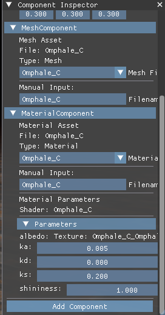
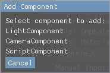
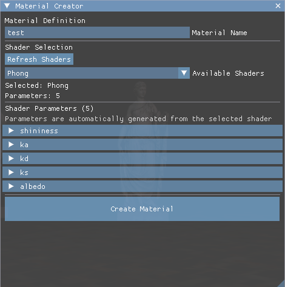
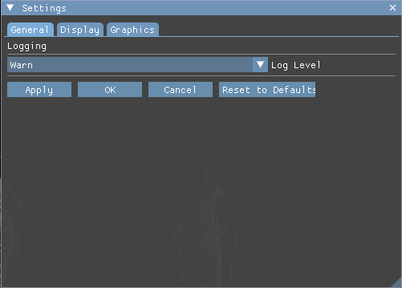
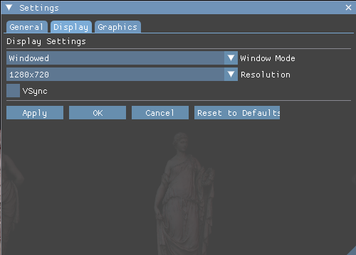
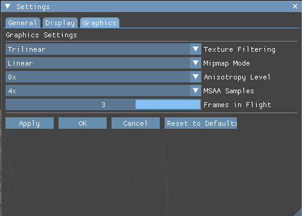

# Vulkan Graphics Engine

A custom 3D graphics engine built on top of the **Vulkan API**, featuring a flexible shader and material system, an ECS-based scene editor, and an asset pipeline with hot-reloading.



---

## Features

- **Vulkan-based renderer** with low-level GPU control
- **Phong lighting model** (ambient, diffuse, specular) — and support for any custom lighting model via shaders
- **Shader reflection system** — automatically reads shader inputs and generates material creators at runtime
- **Custom asset format** with two-stage loading (compressed in RAM, decompressed on demand)
- **LRU + inactivity-threshold asset eviction** for efficient GPU memory management
- **Hot-reloading** — assets in the `Source` folder are watched and recompiled automatically
- **C++ and Lua scripting** for scene logic and object behavior
- **Compute shader support** — create and dispatch compute shaders freely from scripts
- **Scene editor** with hierarchy, component inspector, drag & drop, and prefab support
- **Settings panel** — display mode, resolution, VSync, MSAA, texture filtering, anisotropy, and more

---

## Requirements

- Windows
- GPU with Vulkan support

---

## Project Structure

```
project/
├── Assets/
│   ├── Source/          # Raw assets (models, textures, shaders, ...)
│   └── Compiled/        # Engine-internal format (auto-generated)
└── Scripts/             # C++ and Lua scripts for scene logic and object behavior
```

The engine monitors `Assets/Source/` for changes. Any new or modified asset is automatically converted to the internal format and updated in `Assets/Compiled/` without restarting the application.

---

## Editor

After launching the application, you are taken to the main scene editor.


The UI is divided into several panels:

| Panel | Location | Description |
|---|---|---|
| **Viewport** | Center | Live 3D scene view |
| **Scene Hierarchy** | Bottom-left | Tree view of all scene objects |
| **Component Inspector** | Bottom-right | Edit components of the selected entity |
| **Stats** | Top-right | FPS, frame time, object count, scene name |
| **Menu Bar** | Top | File (load/save scene) and Window (toggle panels) |

### Scene Hierarchy

Supports drag & drop for reorganizing the scene. Right-click context menus differ depending on the selected element:

**Empty area**



- Create new Entity
- Create Prefab instance

**Entity**



- Duplicate
- Create Prefab from entity
- Rename / Delete

**Prefab instance**



- Unpack instance
- Sync with prefab (restore original)
- Override / restore components
- Rename / Delete

### Component Inspector



Displays all components attached to the selected entity. Allows editing properties (transforms, render parameters, etc.), adding new components, and removing existing ones.



### Material Creator



The material creator is driven entirely by shader reflection — no code changes are needed to support a new shader type:

1. Name the material and pick a shader.
2. The engine reads the shader's reflected metadata and displays the required input fields.
3. Fill in values (textures, colors, numeric parameters).
4. Save and use the material immediately in the scene.

### Settings





The settings window has three tabs:

- **General** — log level
- **Display** — fullscreen / windowed / borderless, resolution, VSync
- **Graphics** — texture filtering, mipmap generation, anisotropy level, MSAA sample count, frames in flight

Some settings (resolution, display mode, log level) apply at runtime. Others (MSAA, filtering) require a restart.

---

## Test Models

The engine was validated using high-quality models from [Sketchfab](https://sketchfab.com):

- [Hygieia](https://sketchfab.com/3d-models/hygieia-201eb37f119a4c49be06ef63137f53c0)
- [Flora](https://sketchfab.com/3d-models/flora-1c5a8442ac3344ac9c37019f4b10ea01)
- [Omphale](https://sketchfab.com/3d-models/omphale-5babc36a317f4f25baf6edcad868398c)

---

*Author: Miłosz Zając*
